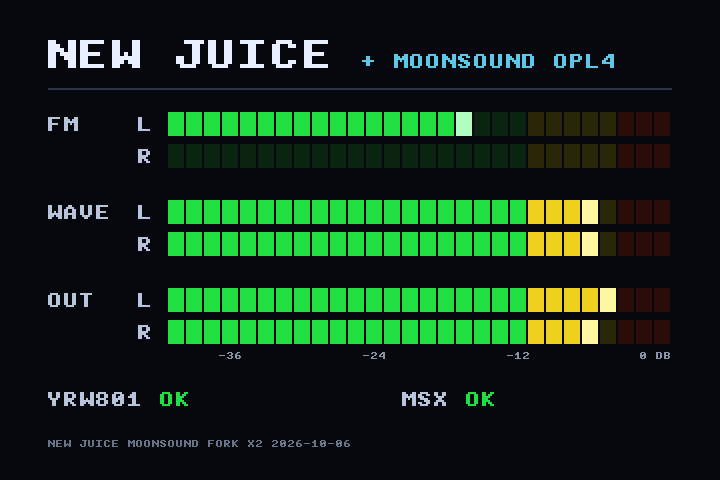

# NewJuice-MoonSound

New Juice for the WonderTANG 2.0b / 2.02b with a **MoonSound** (Yamaha
YMF278B / OPL4: OPL3 FM plus the 24-voice wavetable) in place of **Franky**.

- New Juice is the work of **lfantoniosi**
  (<https://github.com/lfantoniosi/new-juice>). This fork starts at its commit
  `306ca0e` (24 Aug 2026).
- The MoonSound comes from **MoonTANG** (Albert "Papipapito", with Claude),
  commit `5400f15`, which in turn builds on the open cores listed under
  [Licenses](#licenses).
- Branches: `master` is New Juice exactly as upstream; all the work is on
  `moonsound`.

## Status

Experimental. It builds without timing violations with Gowin 1.9.12.03 and
1.9.11.03 Education, and every simulation bench passes (`tools/sim/README.md`;
results in [MOONSOUND.md](MOONSOUND.md)).

First board tests (5 Oct 2026, one WonderTANG 2.02b in an MSXBOOK, whose
OCM-PLD has its own 4 MB mapper): a build of this branch's sources
(`f3e4a2c`, the bitstream now versioned in `impl/pnr/`) **boots**; the one
built from `16a9664` (which still read the mapper back with bit 7 set) **does
not**. Each was tried once, so an intermittent failure is not ruled out yet. See
[Board results](#board-results). Still to check on the board: the MoonSound
itself (MoonBlaster / MBWave and their wave RAM detection), SCC, OPLL,
SFG-01, the debugger, HDMI, and the OPL4 level in the mix, by ear.

HDMI (6 Oct 2026): X1 shows a black picture unless the debugger is on (the
sound scope left with Franky). The sources now show a **VU meter** there:
the OPL4 FM and wave, left and right, what HDMI plays, left and right, the
YRW801 state and whether the MSX clock runs. Built as **X2** (Gowin
1.9.12.03, Place 1 / Route 2, 0 / 0 violated endpoints) and simulated with
the whole design and an HDMI receiver; not seen on a screen yet. The
versioned bitstream is still X1, without the meter. See
[The VU meter on HDMI](#the-vu-meter-on-hdmi).

## Why this repository is private

New Juice has no license, so all its rights stay with its author and a fork
of it cannot be published without his permission. This repository is
therefore private and nothing built from it is distributed. Once the fork
works on a board, lfantoniosi will be told about it, and he decides:

- to take the MoonSound into New Juice, whole or in part; or
- to give a license, or a permission, under which this fork can be published;
- or neither, and then it stays private.

Whatever the outcome, the fork will always be open source and free of
charge. The message to him is drafted in
[docs/message_to_lfantoniosi.md](docs/message_to_lfantoniosi.md) and has not
been sent.

## What changes for the user

| | New Juice | This fork |
|---|---|---|
| MoonSound FM (ports C4h-C7h) | — | **yes**, OPL3, stereo |
| MoonSound wavetable (ports 7Eh-7Fh) | — | **yes**, 24 voices, YRW801 + 1 MB wave RAM, F8h/F9h mix registers |
| Franky: SMS VDP and SN76489 (ports 48h/49h, 88h/89h) | yes | **removed** |
| HDMI picture with the debugger off | sound scope (drawn into Franky's framebuffer) | **VU meter**: OPL4 FM L/R, wave L/R and the HDMI mix L/R, YRW801 and MSX state (drawn on the fly, no framebuffer) |
| Memory mapper | 4 MB | **2 MB** |
| Nextor + microSD, Super-MegaRAM SCC, PSG, OPLL, SFG-01 (OPM), Z80 debugger with its HDMI terminal | yes | yes, unchanged |
| Audio to the MSX (I2S amplifier of the Tang Nano 20K, mono) | about 22 kHz | **48.2 kHz**, mix saturates instead of wrapping around |
| Audio on HDMI | mono, 44.1 kHz | **stereo**, 44.1 kHz |

### What is lost

- **Franky**: SMS games and anything else that uses its VDP or its SN76489.
- **The sound scope** on HDMI; a VU meter takes its place. The debugger
  terminal on HDMI stays.
- **Half of the mapper**: 2 MB (128 pages) instead of 4 MB. Pages 80h-FFh
  mirror 00h-7Fh. IN FCh-FFh returns the register as written, like New
  Juice: a machine with a bigger internal mapper (an OCM / MSXBOOK has 4 MB)
  takes the cartridge's answer, and a page number with bit 7 forced to 1
  could send its software to the wrong segment.

To go back to New Juice, write its own bitstream at flash 0x000000. Its ROMs
stay where they were, and the YRW801 at 0x200000 does not bother it.

## Changes against New Juice

`git diff master..moonsound` shows all of them. They are split into small
commits so that each one can be read on its own; New Juice's code is not
reformatted.

| Commit | What it does |
|---|---|
| `676457f` | Remove Franky (SMS VDP, SN76489, framebuffer) and the sound scope |
| `d268ba8` | Memory map: shrink the memory mapper to 2 MB |
| `cdb3d09` | Add the MoonSound (OPL4) sources from MoonTANG `5400f15` (`src/moonsound/`) |
| `8ebe679` | SDRAM: arbiter in front of the controller, with its own refresh timer |
| `b21e61c` | MoonSound: hook the OPL4 to the bus, the flash, the SDRAM and the clocks |
| `d48c9a4` | Audio: mix the OPL4 with saturation, I2S at 48.2 kHz, stereo HDMI |
| `fb323e5` | SDC: keep the HDMI serializer reset untimed after the Franky removal |
| `58636d1` | Timing: load the SDRAM request registers while idle, off the start decision |
| `1637932` | Documentation, `make yrw801` target and simulation benches (`tools/sim/`) |
| `c02d2a4` | Memory map: read the mapper registers back with bit 7 set (**reverted**, see below) |
| `b0045c0` | MoonSound: release the bus when /RD or /IORQ go up, like New Juice's ports |
| `5d6fcce` | Audio: I2S framing and mid-bit BCLK for the MAX98357A |
| `4f88f85` | Audio: send the whole saturated mix to the amplifier |
| `63eb5be` | Board bench: measure the bus release from the design's own /RD |
| `bb90bcc` | Docs: I2S framing, mapper read-back, place-and-route options, bench results |
| `16a9664` | Build: route option 2, from a place-and-route sweep with both tool versions |
| `a36475a` | Bitstream: version the fork's own bitstream, byte for byte |
| `658349c`, `1f02ec3` | Benches: fail on a stale simulation; `.gitignore`: keep any YRW801 out |
| `f3e4a2c` | Memory map: read the mapper registers back as written again, like New Juice (reverts `c02d2a4`; this is the build that boots on the MSXBOOK) |
| `a83092a`, `8004964` | Docs: board results and the SDRAM interface; the bitstream X1 versioned |
| `437b716` | HDMI: VU meter on the HDMI picture when the debugger is off |
| `fc52a74` | Benches: VU meter (against MoonTANG's, through `hdmi.sv`, ROMs and netlist) and HDMI on the board bench |

New Juice files touched: `src/top.v`, `src/top.sdc`, `new-juice.gprj`,
`src/rpll/rpll_main.v` (CLKOUTD3 brought out), `src/sdram_mapper.v`,
`src/flash_roms.v`, `src/linear_rom.v`, `src/super_megaram.v`,
`src/audio_drive.v` and `src/top.v` again for the VU meter (only the picture
multiplexer of HDMI, the meter and its screen), `Makefile` (new `yrw801` target),
`impl/new-juice_process_config.json` (Route option 2), `.gitignore` and a
three-line notice at the top of `README.md`. New: `src/moonsound/`,
`tools/sim/`, `MOONSOUND.md`, this file and `docs/`.

Some of these changes are useful to New Juice even without the MoonSound:
the I2S framing (`5d6fcce`), the saturating mix (`d48c9a4`, `4f88f85`) and the
timing change of the memory clients (`58636d1`). One more, not applied in
this branch yet, is timing the SDRAM pins: see
[Note for New Juice](#note-for-new-juice-the-sdram-pins-are-not-timed). How
the MoonSound is built in, and why, is explained in
[MOONSOUND.md](MOONSOUND.md).

## Memory maps

SPI flash (8 MB). Only the YRW801 area is new:

| Range | Contents |
|---|---|
| 0x000000-0x0DD899 | bitstream (907 418 bytes) |
| 0x100000-0x11FFFF | Nextor (New Juice, unchanged) |
| 0x120000-0x123FFF | FM-PAC BIOS (unchanged) |
| 0x124000-0x127FFF | SFG-01 BIOS (unchanged) |
| **0x200000-0x3FFFFF** | **YRW801 wave ROM, 2 MB, written by the user** |

SDRAM (8 MB):

| Range | Contents |
|---|---|
| 0x000000-0x1FFFFF | memory mapper, 2 MB (was 4 MB) |
| 0x200000-0x3FFFFF | YRW801 copy (MoonSound wave addresses 0x000000-0x1FFFFF), read-only for the MSX |
| 0x400000-0x5FFFFF | Super-MegaRAM (unchanged) |
| 0x600000-0x627FFF | ROM copies (unchanged) |
| 0x700000-0x7FFFFF | MoonSound wave RAM, 1 MB (wave addresses 0x200000-0x2FFFFF) |

Wave addresses 0x300000-0x3FFFFF have no memory behind them: reads return
FFh and writes are ignored, with no mirror, so a wave RAM size detection
finds 1 MB, the standard size (checked in simulation; MoonBlaster and MBWave
themselves are part of the board test). The free SDRAM is 1.84 MB, not
enough for the 2 MB option.

## Clocks

No new PLL: the MoonSound takes two more outputs of New Juice's main PLL,
`rpll_main`, which are phase-related to main_clk and timed together with it.

| Clock | Source | Frequency | Used by |
|---|---|---|---|
| clkin | board oscillator | 27 MHz | OPLL and OPM (with a 3.58 MHz clock enable), HDMI pixel clock (as in New Juice) |
| main_clk | rpll_main CLKOUT | 108 MHz | bus, SDRAM, PSG, the rest of New Juice, the arbiter, the I2S output (108 MHz / 70 / 32 = 48.2 kHz) |
| opl4_clk54 | rpll_main CLKOUTD | 54 MHz | MoonSound bus side |
| opl4_clk_eng | rpll_main CLKOUTD3 | 36 MHz | PCM engine (clock enable 588/625: 33.8688 MHz on average) and OPL3 FM (36 MHz / 727 = 49.52 kHz) |
| video_clk_135 | rpll_video | 135 MHz | HDMI serializer (as in New Juice) |
| cpu_clk | slot pin | 3.58 MHz | parts of New Juice's bus interface (as in New Juice) |

The OPL3 FM runs at 36 MHz instead of MoonTANG's 27 MHz: with 27 MHz made
by a CLKDIV, its crossing into the 54 MHz side failed hold (34 endpoints,
down to -3.0 ns), and this way it needs one global clock fewer. Its sample
rate and timers were retuned for 36 MHz (`src/moonsound/opl3/opl3_pkg.sv`).

## Resources and timing

GW2AR-LV18QN88C8/I7 (Tang Nano 20K).

| | New Juice (author's bitstream, Gowin 1.9.11) | This fork, 1.9.12.03 (X1, bitstream for the board test) | This fork, 1.9.11.03 Education | With the VU meter, 1.9.12.03 (X2) | With the VU meter, 1.9.11.03 Education, P1 / R2 |
|---|---|---|---|---|---|
| Logic | 12546 / 20736 (61 %) | 17188 (83 %) | 17246 (83 %) | 17807 (86 %) | 18046 (87 %) |
| CLS | 9002 / 10368 (87 %) | 9907 (96 %) | 9825-9899 (95 %) | 10057 (97 %) | 10030 (97 %) |
| Registers (FF) | 8157 | 9523 | 9192 | 9988 | 9630 |
| BSRAM | 46 / 46 | 31 / 46 | 31 / 46 | 34 / 46 | 34 / 46 |
| DSP | 2 | 3.5 | 3.5 | 3.5 | 3.5 |
| PRIMARY / LW clocks | 3 / 8, 8 / 8 | 5 / 8, 8 / 8 | 5 / 8, 8 / 8 | 5 / 8, 8 / 8 | 5 / 8, 8 / 8 |
| rPLL | 2 / 2 | 2 / 2 | 2 / 2 | 2 / 2 | 2 / 2 |
| Worst setup slack (main_clk, 108 MHz) | +0.065 ns | **+0.779 ns** | +0.060 to +1.014 ns | **+0.088 ns** (P1 / R2) | +0.469 ns |

Timing was checked in 18 builds: both tool versions and every place-and-route
option Gowin accepts for this device (10 different implementations). All 18
have **0 setup and 0 hold violated endpoints**; the worst hold slack is
+0.074 ns. The project is set to Place option 1 / Route option 2, the best of
the sweep (+0.779 ns with 1.9.12.03, +0.578 ns with 1.9.11.03). In that build
the other clocks reach, against what they need: opl4_clk54 95.2 / 54 MHz, PCM
engine 41.5 / 36 MHz, clkin 53.9 / 27 MHz, cpu_clk 67.4 / 3.58 MHz. The
tightest paths are still New Juice's own (from `mp_debouncer` to the memory
clients). The full sweep is in [MOONSOUND.md](MOONSOUND.md).

With the VU meter (X2, sources of `437b716`) the same 1.9.12.03 sweep gives,
as worst setup slack and violated setup / hold endpoints: Place 1 / Route 2
(the project setting, the bitstream X2) +0.088 ns, 0 / 0; P1 / R1 +0.212,
0 / 0; P1 / R0 +0.017, 0 / 0; P0 / R2 +0.020, 0 / 0; **P0 / R1 -0.343, 15 / 0**.
1.9.11.03 Education, P1 / R2: +0.469, 0 / 0. The failing paths are New
Juice's own, as in every build so far (`mp_debouncer` to `flash_roms` and
`linear_rom`); the meter is on none of the 25 worst. A cheaper meter does not
make it steadier: a trial build with four bars and no peak marks (222 logic cells
less) closed P0 / R1 (+0.104) and failed P1 / R2 (-2.149 ns, 37 endpoints).
At this fill, which builds close is a matter of placement, so check every
new build.

The chip is full (96-97 % CLS), so slack moves by about 1 ns from build to
build. After any change, read "Numbers of Setup Violated Endpoints" and
"Numbers of Hold Violated Endpoints" in `impl/pnr/new-juice_tr_content.html`:
the summary of the IDE can show no TNS while a clock-domain crossing fails.

Gowin does not time the SDRAM pins in any of these builds: New Juice's SDC
leaves them unconstrained, and so does this branch. The next two sections
say what that means and what was measured.

## The VU meter on HDMI

With the debugger off, HDMI shows this picture (720x480p, New Juice's video
mode); with it on, the debugger terminal, as before:



*A frame as the HDMI receiver of the board bench took it from the cable (simulation, `tools/sim/board/run_board.sh hdmi`): the FM, playing on the left only, has just been muted, so its bar falls and its peak mark stays.*

- Bars, 28 segments of 1.5 dB (the top one is full scale, the bottom one
  42 dB below), with a peak mark that stays 45 frames: **FM** L/R and
  **WAVE** L/R are the two halves of the OPL4 mix (after the F8h level), and
  **OUT** L/R is what HDMI plays (the whole New Juice mix, with HDMI's own
  x2).
- **YRW801**: `...` while it is copied, `OK`, `NO VALIDA` (copied, but the
  checksum says it is not the YRW801) or `ERROR` (the copy failed).
  **MSX**: `OK` while the slot clock runs.
- Footer: the build (`X2` and the date, a parameter in `src/top.v`).

How it is made (MoonTANG's screen and meter, adapted to a full chip):
`src/moonsound/vu_screen.v` draws each pixel from the coordinates of the
HDMI transmitter, without a framebuffer; its title, subtitle and footer are
now parameters, and its two text tables are ROMs in block RAM. The meter,
`src/moonsound/vu_meter_nj.v`, does exactly what MoonTANG's `vu_meter.v`
does (checked frame by frame on random signals) with about a third of its
logic. It runs on opl4_clk54; the HDMI samples (main_clk) enter it through
a register, and its outputs change once per frame, in the vertical blanking,
so the screen (27 MHz) reads them with no synchronizer. The meter and the
screen cost 255 + 252 LUTs (and 52 + 10 ALUs), 279 + 89 registers and 3 block RAMs (X2).

The HDMI transmitter and the video PLL are reset with every MSX /RESET, as
in New Juice: the picture (and HDMI's sound) can drop for a moment, and the
TV may need to find the signal again, each time the MSX is reset. With the
MSX off there is no HDMI at all. The picture is drawn for 16:9 (as in
MoonTANG) but New Juice sends 720x480p as VIC 2, the 4:3 code (its AVI
InfoFrame gives no picture aspect), so a TV that follows it shows the
picture narrower.

## Board results

One WonderTANG 2.02b in an MSXBOOK (OCM-PLD with its own 4 MB internal
mapper), with the same ROMs and YRW801 in the flash; only the bitstream at
0x000000 changed. Each build was tried once.

| Build | Sources | Gowin, Place / Route | MD5 of the `.fs` | On the MSXBOOK |
|---|---|---|---|---|
| upstream | New Juice's own bitstream (`306ca0e`, 1.9.11.03 Education) | author's | `638086e3b7b9d514f1bd6551a39fab6e` | boots |
| M0 | `306ca0e` (New Juice) | 1.9.12.03, 1 / 2 | `605fe317e28265917e100c6908f108c3` | boots |
| B2 | `8ebe679` (arbiter, OPL4 not hooked up) | 1.9.12.03, 1 / 2 | `1fd5465162108687cdc99289c4594351` | does not boot (no BIOS) |
| B3 | `58636d1` (OPL4 hooked up) | 1.9.12.03, 1 / 2 | `ea2f799972d5c118a96b5e76b83f366f` | not tried yet |
| B4 | `c02d2a4` (B3 + mapper read-back with bit 7 set) | 1.9.12.03, 1 / 2 | `57ece881eb1c380fa2e09b8041439e92` | boots |
| fork | `16a9664` (bit 7 set; the bitstream in `impl/pnr/`) | 1.9.12.03, 1 / 2 | `c2ef5122bdc7ca1033023a451b08b045` | boot loop: the BIOS looks for RAM again and again, the SD never stops |
| Y1 | `16a9664` | 1.9.12.03, 0 / 1 | `a3d0917f9bdbbd45c683f8746dd00447` | MSX logo, then nothing |
| Y2 | `16a9664` | 1.9.12.03, 0 / 2 | `ddc6253b09ed2b8a5b723d2e887434ff` | not tried yet |
| X1 | `16a9664` without bit 7 = the sources of `f3e4a2c` | 1.9.12.03, 1 / 2 | `276425bea832b1272213ce9a55dcfe29` | **boots** |
| X2 | `437b716` (X1 + the VU meter on HDMI) | 1.9.12.03, 1 / 2 | `81e3e381e6a8b95b9e7c1e295b34bfd9` | not tried yet |

- The file first tried as "B3" was New Juice's own bitstream from upstream
  (its header says 1.9.11.03 Education; its MD5 is that of
  `impl/pnr/new-juice.fs` at `306ca0e` with CRLF line ends). The real B3
  build has not been tried. The commit message of `f3e4a2c` says that
  builds of the same sources boot or not depending on the placement; that
  rested on this mix-up and **is not supported** by the results: the only
  pair of the same sources tried, fork and Y1, fails both times.
- What the results do show: with the mapper registers read back with bit 7
  set, the fork fails in both placements tried, and without it (X1) it
  boots. The MSXBOOK has its own 4 MB mapper and takes the cartridge's
  answer to IN FCh-FFh (New Juice drives /BUSDIR there, `cd_demux.v`), so a
  page number with bit 7 forced to 1 can send it to the wrong segment. The
  exception is B4, which boots with bit 7 set; it differs from the fork in
  the bus release (`b0045c0`) and the audio changes, and was tried once.
- B2 fails for a reason still unknown. It is the only failing build that
  could be an SDRAM fault: the fork reaches the SD, so the ROMs were copied,
  and New Juice copies them only after its SDRAM start-up test has passed
  (`flash_roms` `.load_enable(startup_test_passed)` in `src/top.v`). Until
  that test passes the LED shows the test pattern; after it, SD activity.
- Next tests: B3 (real), Y2, X1 in other placements, each build several
  times from cold, noting what the LED does; and on the MSXBOOK
  `OUT &HFC,5 : PRINT INP(&HFC)` with B4 (133 = it reads the cartridge's
  answer).

## The SDRAM interface

`src/sdram.v` (nand2mario's controller) runs at main_clk (108 MHz); the SDRAM
clock is rpll_main CLKOUTP, 180 degrees later. READ leaves on edge E2, the
die samples it at S2 = E2 + T/2, with CAS latency 3 it drives the word tAC
after S4 and holds it tOH after S5, and the clients capture `dout32` (the
pins, combinational) on E6 = S4 + 1.5 T. `src/top.sdc` has the SDRAM clock
commented out and no input or output delay on any SDRAM pin, so Gowin
never checks any of this.

To see whether that explains the boot failures, the eight builds above were
placed and routed again with the post-PnR SDF on (each bitstream identical
to the tried one except for the build time in its header), the SDRAM paths
were measured from the SDF, and an SDC that times them was written and
checked against Gowin's own report (to 0.035 ns). Gowin does not publish the
die's timing; the numbers are those of an equivalent 64 Mbit x32 SDR part at
CL3, -6 grade: tAC 6.0, tOH 2.5, tIS 1.5, tIH 1.0 ns, plus 0.2 ns of bond
wire mismatch. Worst slack, slow corner (typical in brackets), ns:

| Build | Board | Write data (DQ) | Address | Command, BA, DQM | Read capture setup / hold | Arbiter wave read (`wv_dout`) |
|---|---|---|---|---|---|---|
| M0 | boots | -0.368 (+0.357) | +2.024 | +2.866 | +1.488 / +1.555 | — |
| B2 | fails | -1.624 (-0.640) | +1.262 | +2.866 | the same | — |
| B4 | boots | -0.883 (-0.037) | +0.720 | +2.866 | the same | -1.468 |
| fork | fails | -0.640 (+0.145) | +0.946 | +2.866 | the same | -1.225 |
| Y1 | fails | **+0.626** (+1.076) | +1.173 | +2.866 | the same | -1.119 |
| X1 | boots | -0.097 (+0.567) | +1.020 | +2.866 | the same | -0.984 |

- The read capture (`read_data_reg` of `sdram_command_adapter`) is packed in
  the I/O cells in every build (the report's "I/O Register as FF 66/363"),
  and so are command, BA and DQM: their timing is the same in all builds.
- What moves with the placement is the write data and its output enable:
  `dq_out` feeds two pins per bit (`{din,din}`), so it cannot go in the I/O
  cell. `wv_dout` is negative in every build with the arbiter, booting or
  not, and only serves the OPL4's wave reads.
- **The numbers do not separate the builds that boot from those that
  fail**: Y1 has the best write margin and fails; B4 and X1 have worse ones
  and boot. The SDRAM interface is not the cause of the boot failures seen
  so far.

The SDC is kept out of this branch for now. With it, `f3e4a2c` reports 17
setup violations (write DQ down to -0.130, `wv_dout` -1.022). Closing them
needs an RTL change too: one `dq_out` and one `dq_oen` register per pin
(kept with `syn_preserve`) and an I/O-cell capture of the pins on every
edge, which moves `data_ready` and `busy` one clock later. That version has
0 setup and 0 hold violations in Place 1 / Route 2 and in Place 0 / Route 1
(write DQ +2.833, read +1.451 / +1.320, address +0.747 and +1.140, main_clk
Fmax 115.2 and 109.9 MHz) and passes the `arb` and `map` benches, but every
read takes one clock more: CPU `cmd_en`->ack 10 -> 11 clocks at least, the
worst case at 7.16 MHz 139 -> 157 ns, in a design that serves the Z80
without /WAIT. It is hygiene, not a boot fix, and it waits for board time.
The only real measure of the die's margin is a sweep of the CLKOUTP phase
(PSDA_SEL, 16 steps) on the board with a longer start-up test.

## Note for New Juice: the SDRAM pins are not timed

This applies to New Juice as it is upstream, and is worth telling
lfantoniosi. Its `src/top.sdc` comments out the SDRAM clock and constrains
no SDRAM pin, so Gowin never times that interface and its reports say
nothing about it. Measured on New Juice's sources built with 1.9.12.03
Place 1 / Route 2 (M0 above): reads, commands, BA and DQM sit in the I/O
cells and have margin (read +1.488 / +1.555, commands +2.866), but the
write data has -0.368 ns in the slow corner (+0.357 typical), and that path
lands wherever the placer puts it, build after build. That build boots and
no failure has been traced to it, so this is unchecked margin, not a known
bug. New Juice's own bitstream (1.9.11.03) was not measured.

What would time it, written for `src/top.sdc` (the clock names are New
Juice's; the latency of the SDRAM clock at its pin, 11.455 / 7.398 ns, was
taken from the SDF and is the same in every build, because Gowin treats a
clock on a port as ideal):

```
create_generated_clock -name sdram_clk -source [get_ports {clkin}] -master_clock clkin -divide_by 1 -multiply_by 4 -phase 180 -add [get_pins {rpll_main/rpll_inst/CLKOUTP}]
create_generated_clock -name sdram_clk_pin -source [get_pins {rpll_main/rpll_inst/CLKOUTP}] -master_clock sdram_clk -divide_by 1 -multiply_by 1 -add [get_ports {O_sdram_clk}]
// (and add sdram_clk sdram_clk_pin to main_clk's group in set_clock_groups)
set_output_delay -clock sdram_clk_pin -max -9.755 [get_ports {O_sdram_addr[*] O_sdram_ba[*] O_sdram_dqm[*] O_sdram_cas_n O_sdram_ras_n O_sdram_wen_n O_sdram_cs_n O_sdram_cke IO_sdram_dq[*]}]
set_output_delay -clock sdram_clk_pin -min -8.598 [get_ports {O_sdram_addr[*] O_sdram_ba[*] O_sdram_dqm[*] O_sdram_cas_n O_sdram_ras_n O_sdram_wen_n O_sdram_cs_n O_sdram_cke IO_sdram_dq[*]}]
set_input_delay -clock sdram_clk_pin -max 17.655 [get_ports {IO_sdram_dq[*]}]
set_input_delay -clock sdram_clk_pin -min 9.698 [get_ports {IO_sdram_dq[*]}]
set_multicycle_path -from [get_ports {IO_sdram_dq[*]}] -to [get_clocks {main_clk}] -setup -end 2
```

- Outputs: max = tIS + 0.2 - 11.455 = -9.755; min = -(tIH + 0.2) - 7.398 =
  -8.598. Inputs: max = 11.455 + 0.2 + tAC = 17.655; min = 7.398 - 0.2 +
  tOH = 9.698. The `-add` matters: without it Gowin 1.9.12 drops the port
  clock (TA1119) and then every I/O delay fails.
- With the SDC alone the write data shows as violated; to meet it, give
  `sdram.v` one write register and one output-enable register per pin, as
  described in the previous section. In this fork the per-pin write
  registers alone pushed the read capture out of the I/O cells (read setup
  -1.855 ns), so the read capture had to move into its own I/O register as
  well, which costs the clock of read latency.

## Building and flashing

```
make init                                 # submodules (jt49, jt51, jtopl, Nextor)
make reprogram                            # the bitstream in the repository to flash 0x000000, no build
make                                      # Gowin gw_sh -> impl/pnr/new-juice.fs
make rebuild                              # always runs Gowin, even if nothing changed
make program                              # build if needed, then bitstream to flash 0x000000
make roms                                 # New Juice's Nextor and FM-PAC + SFG-01, as before
make yrw801 YRW801=/path/to/yrw801.rom    # your own YRW801 image to flash 0x200000
```

The repository carries a built bitstream, as New Juice does:
`impl/pnr/new-juice.fs` and `.bin` are this fork's bitstream for the board
test (X1: Gowin 1.9.12.03, Place 1 / Route 2, sources of `f3e4a2c`; MD5 of
the `.fs` `276425bea832b1272213ce9a55dcfe29`, of the `.bin`
`f2fc3ffd2d2d64d757edfa589ada2862`; 0 / 0 violated endpoints, worst setup
+0.832 ns). `.gitattributes` keeps both
byte for byte, so a checkout gives exactly those checksums. The other files
under `impl/` (reports, synthesis netlist) are still New Juice's from
upstream until the next build overwrites them.

It is X1 in [Board results](#board-results), the build that boots on the
MSXBOOK; it replaced the `16a9664` build ("fork" there), which does not.

- `make reprogram` writes that file as it is, without building: only
  openFPGALoader is needed. This is what New Juice's README tells a new user
  to run, and in this fork it writes the MoonSound bitstream, not New Juice's.
- `make` and `make program` run Gowin only when a source file is newer than
  `impl/pnr/new-juice.fs` (after a clone the file dates decide), and they ask
  for the Gowin IDE even when nothing has to be built.
- `make rebuild` always runs Gowin and overwrites `impl/pnr/`, versioned
  bitstream included. A rebuild of the same sources gives a different `.fs`
  (its header carries the build time), and another Gowin version places and
  routes it differently, so check its timing (see above) before committing it.

`make` needs the Gowin IDE (`GOWIN_IDE=...` or `GW_SH=...`) and the
programming targets need openFPGALoader, as in New Juice. Without the
Makefile: write the bitstream with Gowin Programmer in *External Flash Mode*
or `openFPGALoader -b tangnano20k -f new-juice.fs`, and the YRW801 with
`openFPGALoader -b tangnano20k --external-flash -o 2097152 yrw801.rom`.

- Flash with the MSX off (or the WonderTANG out of the slot) and the Tang
  powered from USB. On a 2.0b the core uses the JTAG pins: hold **S1** while
  plugging the USB cable in, and during the whole programming, as the
  WonderTANG instructions say.
- After every flashing, check that the YRW801 is still there: some tools
  erase more than they write.
- If the YRW801 is missing, or 0x200000 holds something else, the FM works,
  the wavetable plays garbage and the LED gives a short flash every 1.2 s
  (it still shows SD activity, as before).
- At power-on New Juice copies its ROMs first, with the MSX held by /WAIT as
  before. Then the YRW801 is copied to the SDRAM in the background, about
  1.7 s, while the MSX runs; until then the wavetable is held in reset. The
  FM works at once.
- S1 restarts the whole board (ROMs and YRW801 are copied again); S2 is New
  Juice's debugger, as before.

### The YRW801

The MoonSound needs the Yamaha YRW801 wave ROM (2 MB). It is copyrighted by
Yamaha, so it is **not** in this repository and never goes into a release:
each user writes their own image to the flash at 0x200000 (`make yrw801`).
`.gitignore` keeps out any file with `yrw801` in its name, in any case and
any folder (the loader's source `yrw801_loader.v` excepted). A checksum taken while it is copied tells
whether the image is a YRW801 (the LED warning above).

## Known limits

The details are in [MOONSOUND.md](MOONSOUND.md). In short:

- Tried on one board only (an MSXBOOK), and only up to booting: see
  [Board results](#board-results).
- Gowin does not time the SDRAM pins: see
  [The SDRAM interface](#the-sdram-interface).
- IN 7Fh holds the Z80 with /WAIT, which reaches the slot about 194 ns after
  /IORQ: in time at 3.58 MHz, too late at 5.37 MHz or above, where a stale
  byte can be read (MoonTANG behaves the same). Register writes, which is
  what playing music mostly does, are not affected.
- New Juice serves the Z80 without /WAIT. In the board bench memory reads are
  right at 3.58 and 5.37 MHz with or without the MoonSound; at 7.16 MHz about
  half fail with or without it, so that limit is New Juice's own.
- The OPL4 joins the mix at the level of the OPLL; the balance has to be set
  by ear on the board.
- HDMI (picture and sound) drops with every MSX /RESET, and there is none
  with the MSX off: New Juice resets its video PLL and the transmitter with
  the MSX. The VU meter (X2) has not been seen on a screen yet.

## Licenses

New Juice is lfantoniosi's work and has **no license**: all rights are his.
Its submodules and third-party sources keep their own (jt49, jt51 and jtopl
by Jose Tejada: GPL-3.0; Nextor: `kernel/Nextor/LICENSE.md`; IKASCC: BSD-2).

The MoonSound (`src/moonsound/`, details and full texts in
[src/moonsound/NOTICE.md](src/moonsound/NOTICE.md)):

| Part | Files | Author | License |
|---|---|---|---|
| OPL3 FM core | `opl3/*.sv` | Greg Taylor (*opl3_fpga*), clock retune by Jokin Miragaia | LGPL-3.0 |
| FIFO of the OPL3 host interface | `opl3/afifo.v` | Dan Gisselquist | GPL-3.0 |
| YMF278B wavetable engine | `opl4wave/*` | srg320, from MAME's `ymf278b.cpp` (R. Belmont, O. Galibert, hap) | BSD-3-Clause |
| FM wrapper (ports C4h-C7h) | `opl4fm.v` | adapts `cartridge_opl3.sv` of Jokin Miragaia (MangOPL4); changes by Albert "Papipapito" with Claude | BSD-3-Clause + GPL-3.0 for the changes |
| SPI flash reader | `flash_rw.v` | derived from `flash.v` of lfantoniosi's WonderTANG (Copyright (c) 2023 lfantoniosi); changes by Albert "Papipapito" with Claude | BSD-2-Clause + GPL-3.0 for the changes |
| MoonTANG glue: PCM ports and wave cache, wave memory port, YRW801 loader | `opl4_pcm.v`, `wave_sdram.v`, `yrw801_loader.v` | Albert "Papipapito" with Claude | GPL-3.0 |
| New Juice glue: bus, clocks, flash hand-over, mix; SDRAM arbiter | `moonsound_nj.sv`, `nj_sdram_arb.v` | Albert "Papipapito" with Claude | GPL-3.0 |
| VU meter on HDMI: screen, font, level meter | `vu_screen.v` (MoonTANG, changed), `font8x8.v` (MoonTANG, the clean-room font of SlotDoctor), `vu_meter_nj.v` | Albert "Papipapito" with Claude | GPL-3.0 |

Because `afifo.v` is GPL-3.0, `src/moonsound/` as a whole is GPL-3.0. The
simulation benches (`tools/sim/`) are by Albert "Papipapito" with Claude,
GPL-3.0 like the MoonTANG benches they come from. The YRW801 is not part of
any of this: the user supplies it.
